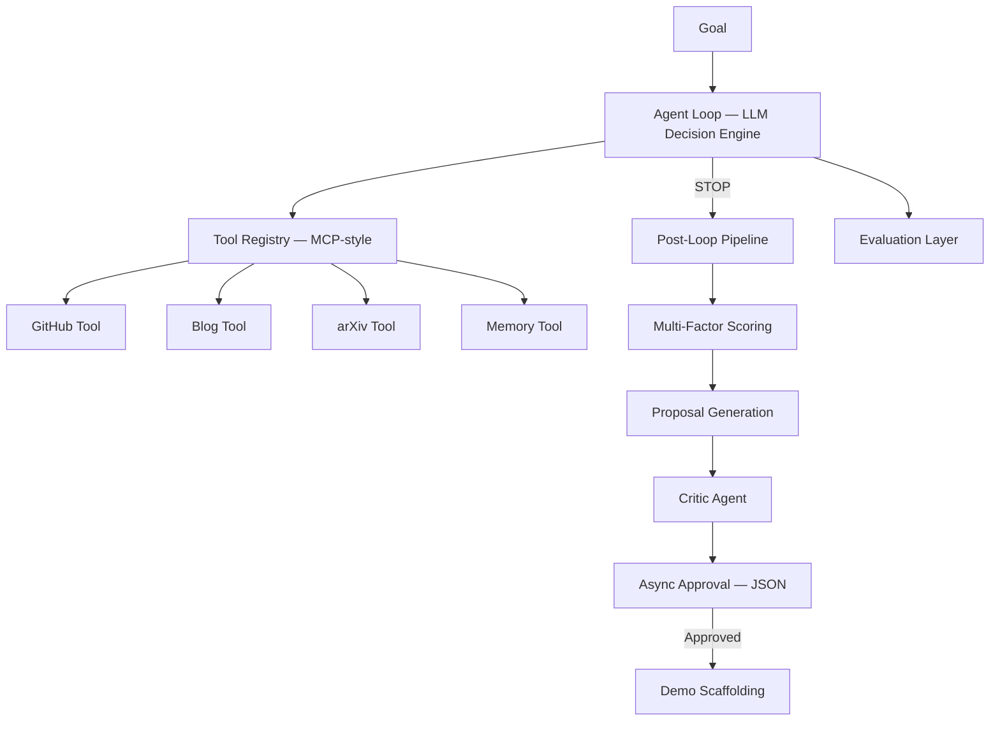

# AI Research Desk (V2 — Agentic + MCP-Style)

An agentic AI system for applied AI teams at financial firms. It dynamically searches GitHub, blogs, and arXiv for relevant ideas, scores them using multi-factor ranking, generates demo proposals, and evaluates its own output quality.

See a real output: [outputs/latest_newsletter.md](outputs/latest_newsletter.md)

## How it works



### Agent Loop (dynamic, LLM-driven)
The agent decides which tools to call based on current state. Applied sources first:
1. **GitHub** — search repos for real implementations, compute leverage scores
2. **Blogs** — fetch from OpenAI, Anthropic, LangChain blogs for practical techniques
3. **Memory** — load past ideas from SQLite for novelty comparison
4. **arXiv** — fetch cs.AI papers when applied sources lack novelty

### Post-Loop Pipeline (fixed order)
After data gathering, these steps always run:
1. **Scoring** — multi-factor ranking (novelty 30% + leverage 30% + relevance 25% + feasibility 15%)
2. **Proposals** — LLM generates demo proposals for the top 2 ideas
3. **Critic** — LLM reviews proposals for specificity, feasibility, differentiation
4. **Approval** — proposals written to `storage/proposals.json` as pending
5. **Demo scaffolding** — generates `app.py` + `backend.py` + `README.md` for approved ideas
6. **Evaluation** — LLM-as-judge scores idea quality, proposal quality, and tool efficiency

## Project structure

```
ai-research-desk/
├── agents/
│   ├── agent_loop.py          # Core LLM decision loop
│   └── critic_agent.py        # Proposal quality gate
├── tools/
│   ├── registry.py            # MCP-style tool registry
│   ├── arxiv_tool.py          # arXiv API + summarization
│   ├── github_tool.py         # GitHub search + leverage scoring
│   ├── blog_tool.py           # RSS feed fetching
│   ├── memory_tool.py         # SQLite persistence + novelty detection
│   └── proposal_tool.py       # LLM proposal generation
├── analysis/
│   └── scoring.py             # Multi-factor scoring system
├── evaluation/
│   └── evaluator.py           # LLM-as-judge + efficiency metrics
├── executor/
│   ├── state_manager.py       # Shared agent state
│   ├── tool_executor.py       # Tool invocation + logging
│   ├── approval.py            # Async JSON-based approval
│   └── demo_generator.py      # Streamlit demo scaffolding
├── models/
│   ├── paper.py               # Paper dataclass
│   ├── idea.py                # Idea dataclass (with score fields)
│   └── proposal.py            # Proposal dataclass
├── utils/
│   ├── llm_client.py          # Claude / OpenAI async client
│   ├── summarizer.py          # LLM paper summarization
│   ├── helpers.py             # Newsletter generation + file I/O
│   └── prompts.py             # All LLM prompt templates
├── storage/                   # SQLite DB + logs + proposals.json
├── outputs/                   # Generated newsletters
├── demos/                     # Generated demo scaffolds
├── config.py                  # All configuration
├── main.py                    # Entry point
└── requirements.txt
```

## Setup

**1. Install dependencies**

```bash
pip install -r requirements.txt
```

**2. Set your API key**

```bash
# For OpenAI (default)
export OPENAI_API_KEY=your_key_here

# For Claude (set LLM_PROVIDER=claude)
export ANTHROPIC_API_KEY=your_key_here
export LLM_PROVIDER=claude
```

Optional — for GitHub tool (higher rate limits):
```bash
export GITHUB_TOKEN=your_token_here
```

**3. Run**

```bash
python main.py
```

**4. (Optional) Create a shortcut**

```bash
alias research-desk="cd /path/to/ai-research-desk && python main.py"
```

## Configuration

All settings live in [config.py](config.py):

| Variable | Default | Description |
|---|---|---|
| `LLM_PROVIDER` | `openai` | `claude` or `openai` |
| `CLAUDE_MODEL` | `claude-sonnet-4-6` | Claude model ID |
| `OPENAI_MODEL` | `gpt-4o` | OpenAI model ID |
| `LLM_MAX_TOKENS` | `4096` | Max tokens per LLM call |
| `MAX_STEPS` | `10` | Max agent loop iterations |
| `ARXIV_QUERY` | `cat:cs.AI` | arXiv category/query |
| `MAX_PAPERS` | `30` | Max papers to fetch per run |
| `DAYS_LOOKBACK` | `7` | How many days back to search |
| `NOVELTY_THRESHOLD` | `0.30` | Jaccard similarity cutoff |

## Output

Each run produces:
- `outputs/latest_newsletter.md` — weekly digest with scores and proposals
- `storage/proposals.json` — proposals with approval status (pending/approved/rejected)
- `storage/logs/eval_<timestamp>.json` — evaluation scores (idea quality, proposal quality, tool efficiency)
- `storage/logs/week_<label>.json` — full data snapshot
- `demos/idea_<id>/` — generated demo scaffolds for approved ideas

## Design Decisions

- **Applied sources first** — GitHub repos and blogs are searched before arXiv because the system is for applied AI teams, not deep research
- **MCP-style tool registry** — tools are described by schema and selected dynamically by the LLM, enabling non-linear execution
- **Agent loop + fixed pipeline** — data gathering is dynamic (LLM decides), but scoring → proposals → critic always run in order
- **Multi-factor scoring** — combines novelty (Jaccard), leverage (GitHub signals), relevance (keyword match), and feasibility (repo completeness)
- **Evaluation framework** — LLM-as-judge rates output quality; tool efficiency is tracked automatically
- **Async approval** — proposals are written to JSON so approval can happen outside the run
