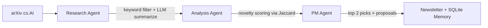

# AI Research Desk (MVP)

AI engineering teams at financial firms need to stay current on research but don't have time to read 30+ papers a week. This pipeline automates the scouting, filtering, and proposal generation — surfacing the most relevant cs.AI papers and turning them into actionable demo proposals scoped for FinServ teams.

See a real output: [outputs/latest_newsletter.md](outputs/latest_newsletter.md)

## How it works



1. **Research Agent** — fetches cs.AI papers from the past 7 days, pre-filters by agent/FinServ keywords (saving LLM calls), and summarizes relevant papers via LLM.
2. **Analysis Agent** — scores and ranks ideas by novelty using Jaccard similarity against past ideas stored in SQLite. Papers with no extractable key idea are dropped.
3. **PM Agent** — selects the top 2 ideas and generates demo proposals framed for a FinServ AI engineering team.
4. **Output** — saves a dated Markdown newsletter, a run report (JSON), and persists ideas to SQLite for future deduplication.

## Project structure

```
ai-research-desk/
├── agents/
│   ├── research_agent.py    # arXiv fetch + summarize
│   ├── analysis_agent.py    # novelty scoring + ranking
│   └── pm_agent.py          # top-2 selection + proposal generation
├── models/
│   ├── paper.py             # Paper dataclass
│   ├── idea.py              # Idea dataclass
│   └── proposal.py          # Proposal dataclass
├── tools/
│   ├── arxiv_tool.py        # arXiv API wrapper
│   ├── summarizer_tool.py   # LLM summarization
│   ├── proposal_tool.py     # LLM proposal generation
│   └── memory_tool.py       # SQLite persistence
├── utils/
│   ├── llm_client.py        # Claude / OpenAI client
│   ├── helpers.py           # Newsletter generation + file I/O
│   └── prompts.py           # LLM prompt templates
├── storage/                 # SQLite DB + logs (gitignored)
├── outputs/                 # Generated newsletters (gitignored)
├── config.py                # All configuration constants
├── main.py                  # Entry point
└── requirements.txt
```

## Setup

**1. Install dependencies**

```bash
pip install -r requirements.txt
```

**2. Set your API key**

Create a `.env` file in the project root (this file is gitignored):

For Claude (default):
```bash
echo "ANTHROPIC_API_KEY=your_key_here" > .env
```

For OpenAI (also set `LLM_PROVIDER = "openai"` in `config.py`):
```bash
echo "OPENAI_API_KEY=your_key_here" > .env
```

**3. Run**

```bash
source .env && python main.py
```

**4. (Optional) Create a shortcut**

Add this alias to your `~/.zshrc` so you can run `research-desk` from anywhere:

```bash
alias research-desk="cd /path/to/ai-research-desk && source .env && python main.py"
```

Then reload your shell: `source ~/.zshrc`

You'll be prompted to confirm before each run, and again to approve the top 2 ideas for demo exploration.

## Configuration

All settings live in [config.py](config.py):

| Variable | Default | Description |
|---|---|---|
| `ARXIV_QUERY` | `cat:cs.AI` | arXiv category/query |
| `MAX_PAPERS` | `30` | Max papers to fetch per run |
| `DAYS_LOOKBACK` | `7` | How many days back to search |
| `LLM_PROVIDER` | `claude` | `claude` or `openai` |
| `CLAUDE_MODEL` | `claude-sonnet-4-6` | Claude model ID |
| `OPENAI_MODEL` | `gpt-4o` | OpenAI model ID |
| `NOVELTY_THRESHOLD` | `0.35` | Jaccard similarity cutoff for novelty |

## Output

Each run produces:
- `outputs/latest_newsletter.md` — the full weekly digest with summaries and proposals
- `storage/logs/run_report_<timestamp>.json` — pipeline stats (papers fetched, filtered, novel vs incremental, etc.)
- `storage/logs/week_<label>.json` — full data snapshot for the week

Approved ideas are flagged in `storage/memory.db` for deduplication in future runs.

## Design Decisions

- **Pre-filter before LLM calls** — keyword matching against title + abstract before summarization avoids wasting LLM calls on irrelevant papers
- **Jaccard novelty scoring** — simple, interpretable, and doesn't require embeddings or an external service. Domain stopwords prevent false matches on high-frequency FinServ terms
- **Structured run reports** — every run saves a JSON report with pipeline stats, enabling monitoring and trend analysis over time
- **No key idea = skip** — papers where the LLM can't extract a key idea are dropped from analysis rather than being falsely labeled as novel
- **Prompts carry the domain context** — FinServ scoping lives entirely in config keywords and prompt templates, keeping agents and tools domain-agnostic and reusable
